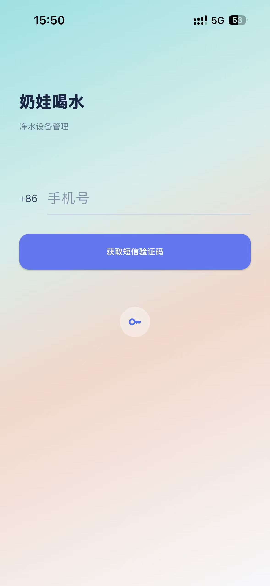
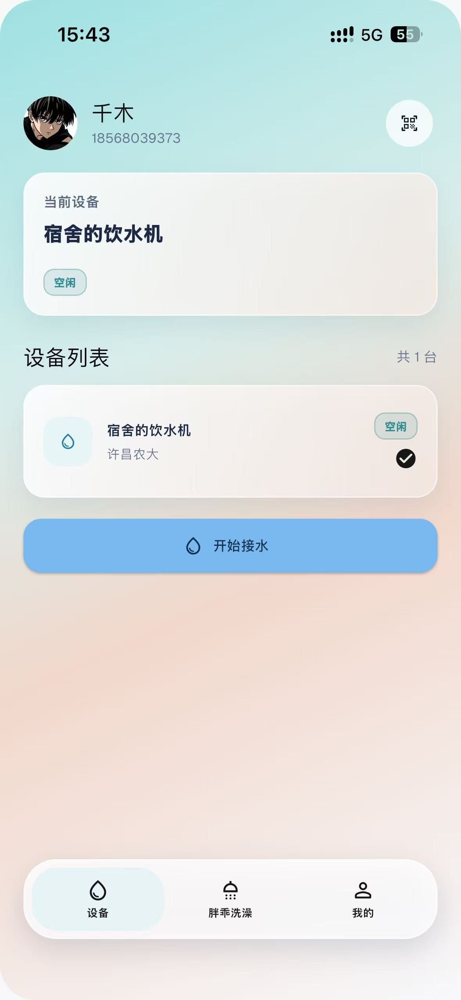
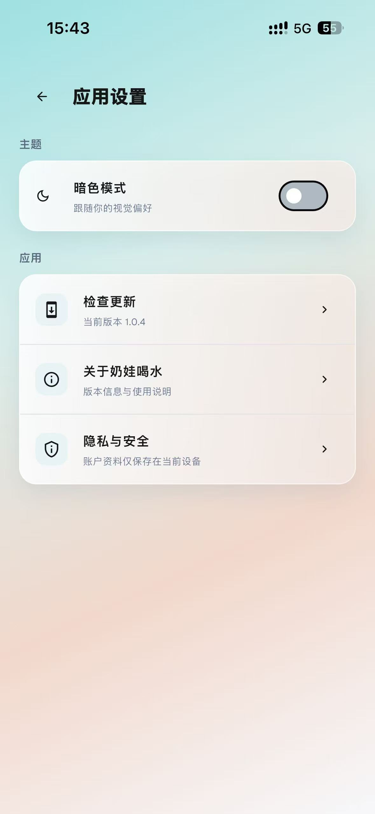
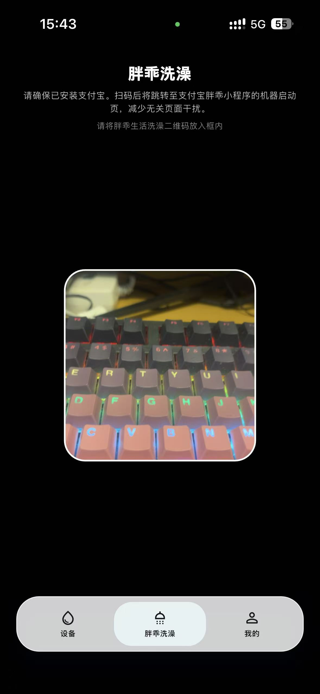

<p align="center">
  
</p>

<h1 align="center">奶娃喝水</h1>

<p align="center">
  适配于惠生活798饮水机及胖乖生活洗澡的设备管理应用。
  支持短信与登录凭证登录、设备扫码绑定、开始与停止接水、设备状态查询、喝水记录、桌面快捷组件，以及胖乖洗澡二维码跳转。
</p>

<h2 align="center">应用截图</h2>

<p align="center">
  
  
  
  
</p>

## 功能

- **账户登录**：支持短信验证码和登录凭证两种方式。
- **设备管理**：扫码绑定饮水机，查看状态、添加备注并管理常用设备。
- **饮水操作**：开始或停止接水，并保留饮水记录供随时查看。
- **桌面快捷组件**：在 Android 桌面选择常用设备，一键快捷启动。
- **胖乖洗澡**：扫描胖乖生活洗澡二维码，跳转至对应服务。
- **版本检查**：读取 GitHub Release，发现新版本后提供安装包下载入口。

## 使用方式

1. 登录账号后，在首页扫描饮水机二维码完成设备绑定。
2. 从设备列表选择设备，查看状态并开始或停止接水。
3. 在“我的”中管理账户、饮水记录、主题和桌面快捷组件。
4. 使用“胖乖洗澡”扫描服务二维码，打开对应服务。

## 开发运行

### 环境要求

- Flutter `3.13+`
- Dart SDK `3.13+`
- Android Studio（Android 构建）
- Xcode（仅 macOS，用于 iOS 构建）

### 本地启动

```bash
flutter pub get
flutter run
```

### 构建 Android 安装包

```bash
flutter build apk --release
```

构建产物位于 `build/app/outputs/flutter-apk/app-release.apk`。

## 安装与更新

- **Android**：下载 APK 后直接安装；同一签名的新版本可覆盖现有应用，无需先卸载。
- **iOS**：项目生成的是未签名 IPA，需要通过 Xcode、Sideloadly 或 AltStore 等方式使用有效 Apple ID/证书重新签名后安装。
- **检查更新**：应用会查询 GitHub 最新 Release，跳转到对应平台的安装包下载页。当前为安装包更新，尚未接入 OTA 热更新。

## 发布版本

GitHub Actions 在推送 `vX.Y.Z` 版本标签后会同时构建：

- `NaiWawate-android.apk`：Android 安装包。
- `NaiWawate-ios-unsigned.ipa`：iOS 未签名安装包。

发布前同步更新 `pubspec.yaml` 中的 `version`，然后创建并推送版本标签：

```bash
git tag v1.0.5
git push origin v1.0.5
```

工作流会自动构建 Android APK 与未签名 iOS IPA，创建 GitHub Release 并上传两个产物。普通提交只更新代码和文档，不会触发打包。

## 隐私说明

登录凭证仅保存在当前设备，用于快捷登录。请勿向他人分享登录凭证。
